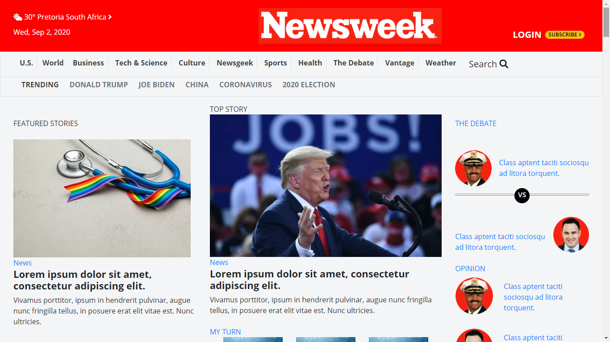

# A NEWSWEEK page

This project is based on The Odin Project and Microverse peer programming collaborative coding. It involves cloning a page that matches the look of a [NEWSWEEK page](https://www.newsweek.com)

This is a collaborative project carried out by Tshepo Molefe and Oluwaseun Iyadi, as part of the PROJECT: USING-BOOTSTRAP. This project is aimed at learning and using BOOTSTRAP to the style web pages.

## Built With
- Bootstrap
- HTML5
- CSS3
- Google Icons
- SVG sources, images

## Live Demo

[Live Demo Link](https://raw.githack.com/CornerstoneII/Using-Bootstrap/feature/index.html)

## Getting Started

**To get your own copy of our project clone the repository to your local machine.**

## Authors

👤 **Tshepo Molefe**

- Github: [@tshepo](https://github.com/TSHEPO-CLOUD)
- Twitter: [@tshepo](https://twitter.com/tshepomolefe)
- Linkedin: [TSHEPO MOLEFE](https://linkedin.com/tshepo-molefe)

👤 **Oluwaseun Iyadi**

- Github: [@CornerstoneII](https://github.com/CornerstoneII)
- Twitter: [@It_Iz_I](https://twitter.com/It_Iz_I)
- Linkedin: [Oluwaseun Iyadi](https://www.linkedin.com/in/oluwaseun-iyadi-773584b4/)

## 🤝 Contributing

Contributions, issues and feature requests are welcome!

Feel free to check the [issues page](issues/).

## Show your support

Give a ⭐️ if you like this project!

## 📝 License

This project is [MIT](lic.url) licensed.
